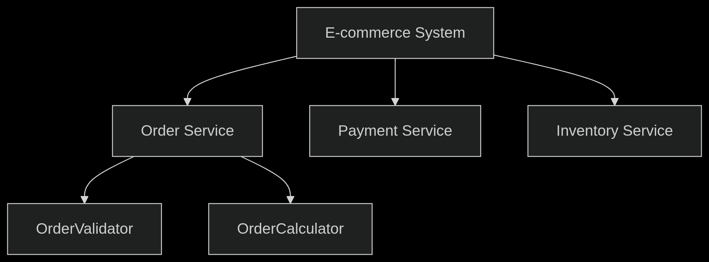

# 🧠 Single Responsibility Principle (SRP)

<!-- TOC -->

* [🧠 Single Responsibility Principle (SRP)](#-single-responsibility-principle-srp)
    * [📖 What Is It?](#-what-is-it)
    * [💡 Key Concepts](#-key-concepts)
    * [🧪 Java Example (Bad Design – Violates SRP)](#-java-example-bad-design--violates-srp)
    * [✅ Java Example (Good Design – SRP Applied)](#-java-example-good-design--srp-applied)
    * [🌍 Real-World Analogy](#-real-world-analogy)
    * [🛠 Real Application Example](#-real-application-example)
    * [🧠 Interview Preparation](#-interview-preparation)
    * [📌 Summary](#-summary)

<!-- TOC -->

> "A class should have only one reason to change." – Robert C. Martin

The **Single Responsibility Principle (SRP)** is the first of the five SOLID principles of object-oriented design. It
states that a class should **only have one responsibility**, meaning it should **only have one reason to change**.

---

## 📖 What Is It?

In simple terms, the **SRP** means a class should **do one thing and do it well**.

A class with multiple responsibilities is harder to:

* Understand
* Maintain
* Extend
* Test

By separating responsibilities, you reduce the chances of bugs and make your code more modular and reusable.

---

## 💡 Key Concepts

| Concept             | Description                                                                |
|---------------------|----------------------------------------------------------------------------|
| **Responsibility**  | A reason for a class to change.                                            |
| **High Cohesion**   | When a class focuses on a single task, its internal logic becomes clearer. |
| **Low Coupling**    | Smaller, focused classes are easier to reuse and test independently.       |
| **Maintainability** | Is improved by minimizing unrelated changes to the same class.             |

---

## 🧪 Java Example (Bad Design – Violates SRP)

```java
public class Invoice {
    private String customer;
    private double amount;

    public Invoice(String customer, double amount) {
        this.customer = customer;
        this.amount = amount;
    }

    public void calculateTotal() {
        // logic for total calculation
    }

    public void printInvoice() {
        // logic for printing
    }

    public void saveToDatabase() {
        // logic for saving invoice to DB
    }
}
```

**❌ What's Wrong Here?**

* `Invoice` handles:

    * Business logic (total calculation)
    * UI/printing logic
    * Data persistence

So it has **multiple reasons to change**, violating SRP.

---

## ✅ Java Example (Good Design – SRP Applied)

```java
// Class 1: Handles invoice data and business logic
public class Invoice {
    private String customer;
    private double amount;

    public Invoice(String customer, double amount) {
        this.customer = customer;
        this.amount = amount;
    }

    public double calculateTotal() {
        // logic for total calculation
        return amount * 1.16; // e.g., 16% tax
    }
}

// Class 2: Handles printing
public class InvoicePrinter {
    public void print(Invoice invoice) {
        System.out.println("Invoice for: " + invoice.customer);
        System.out.println("Total: " + invoice.calculateTotal());
    }
}

// Class 3: Handles data persistence
public class InvoiceRepository {
    public void save(Invoice invoice) {
        // logic to save invoice to DB
    }
}
```

**✅ Benefits:**

* Each class has one responsibility
* Easier to test and extend (e.g., use different printers or repositories)
* Follows **SRP** perfectly

---

## 🌍 Real-World Analogy

Think of a **restaurant**:

* A **Chef** cooks (single responsibility)
* A **Waiter** serves food (single responsibility)
* A **Cashier** handles billing (single responsibility)

If one person did all of that, they'd be overwhelmed and inefficient.

Similarly, in software, dividing responsibilities leads to more efficient, cleaner systems.

---

## 🛠 Real Application Example

In an e-commerce system:

* The `Order` class handles order data and price calculations
* The `OrderPrinter` class handles exporting the invoice to PDF
* The `OrderRepository` class saves or retrieves orders from a database

📦 This structure:

* Makes the codebase easier to maintain
* Allows for easy swapping of printers (PDF, HTML, console)
* Facilitates better unit testing and mocking

## 🧠 Interview Preparation

**Sample Questions:**

- **How do you identify when a class has multiple responsibilities?**

"I use these heuristics:

1. Method Grouping Test: If I can split methods into distinct groups with no overlap (e.g., save*(), print*(),
   validate*())
2. Change History Analysis: When git history shows the class changing for different business requirements
3. Stakeholder Mapping: When different teams request changes (e.g., DB team + UX team)
4. Test Setup Complexity: When unit tests require mocking unrelated dependencies
5. Cohesion Metrics: Low LCOM4 score (Lack of Cohesion in Methods)

> Example: A UserService handling authentication, PDF exports, and caching clearly violates SRP."

- **Have you ever over-applied SRP? What happened?**

"Yes, early in my career I created:

```java
class AddressValidator {
}

class AddressFormatter {
}

class AddressPersister {
}

class AddressComparator {
}
```

For a simple address book feature. This caused:

* Navigation fatigue: Developers struggled to find logic
* Overhead: DI containers bloated with tiny classes
* Premature abstraction: When requirements didn't change

We consolidated to AddressService with cohesive methods, monitoring change frequency to justify future splits."

- **Is logging a violation of SRP?**

"Logging itself doesn't violate SRP if implemented properly:

```java
// ✅ Acceptable (cross-cutting concern)
public class OrderProcessor {
    private static final Logger LOG = LoggerFactory.getLogger(...);

    public void process(Order order) {
        try {
            // Core logic
        } catch (Exception e) {
            LOG.error("Processing failed", e); // Not core responsibility
        }
    }
}
```

**But becomes violation when:**

* Adding complex log formatting logic
* Implementing log routing decisions
* Handling log retention policies

**For complex cases, use:**

1. AOP with @Loggable
2. Decorator pattern
3. Separate AuditService


- **Can SRP apply at the service/microservice level?**

Senior Response:
"Absolutely - SRP is fractal:



**Microservice SRP Checklist:**

1. Owns one bounded context (Orders ≠ Payments)
3. Has single persistence schema
5. Deployable independently
7. Owned by one team

**Example: At [Company], we split Shipping Service from Orders when:**

* Shipping partners changed 3x/year
* Order logic remained stable
* Reduced deployment failures by 70%"

**Senior Insights:**

- SRP isn’t only for classes – also applies to modules, services, and repositories
- Understand trade-offs: sometimes performance or simplicity might require exceptions

---

## 📌 Summary

| Rule                                         | Explanation                                                                          |
|----------------------------------------------|--------------------------------------------------------------------------------------|
| A class should have **one reason to change** | If a class handles multiple concerns, changes in one concern could affect the others |
| Keep classes **small and focused**           | This enhances reusability and testability                                            |
| **Delegate responsibilities**                | Separate classes should handle UI, persistence, and business logic independently     |

---

✅ Applying the Single Responsibility Principle leads to **modular**, **testable**, and **robust** software designs.

> “SRP is simple, but its simplicity is powerful.”

---
